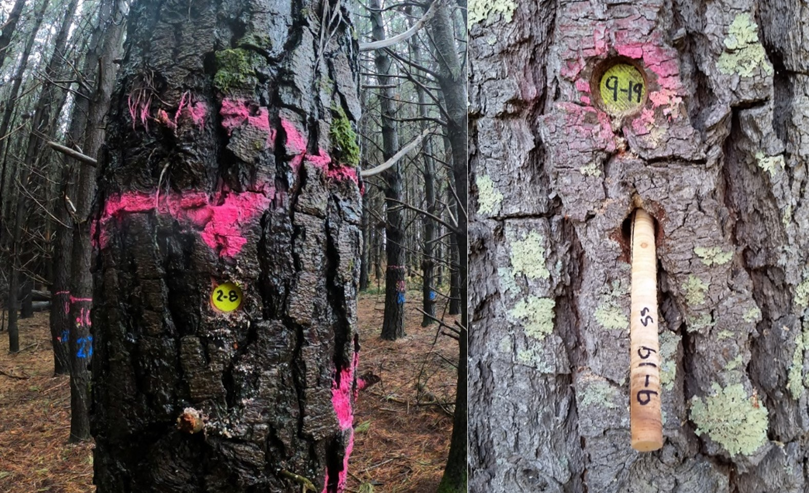
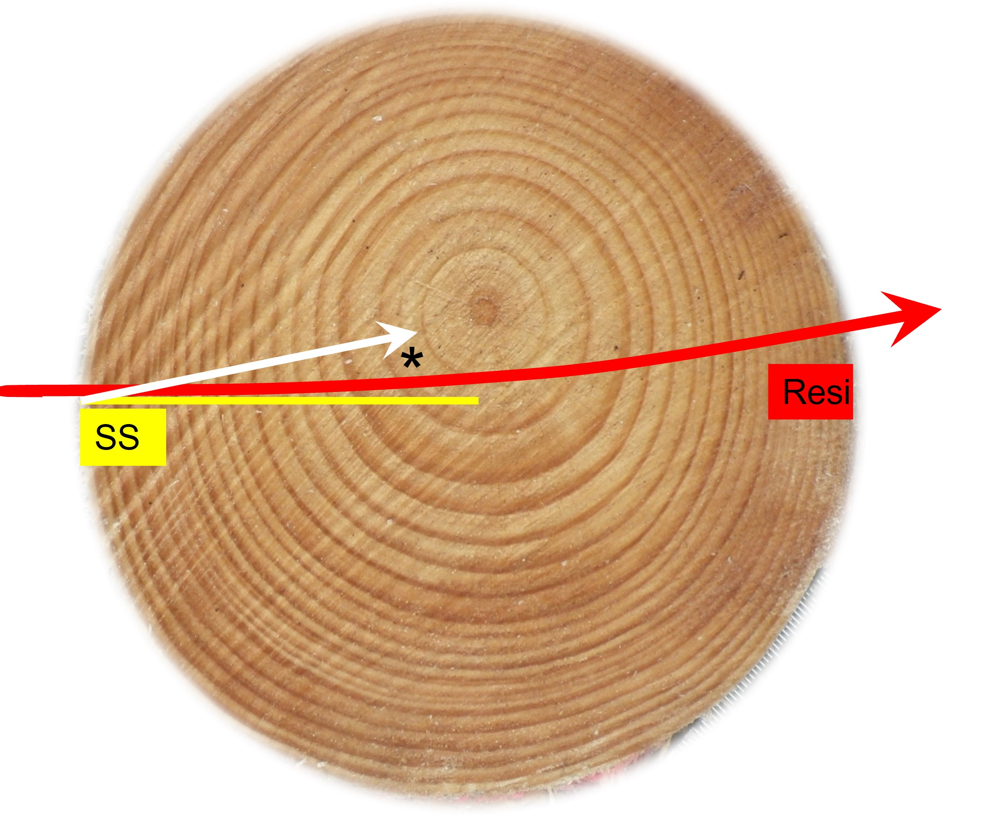
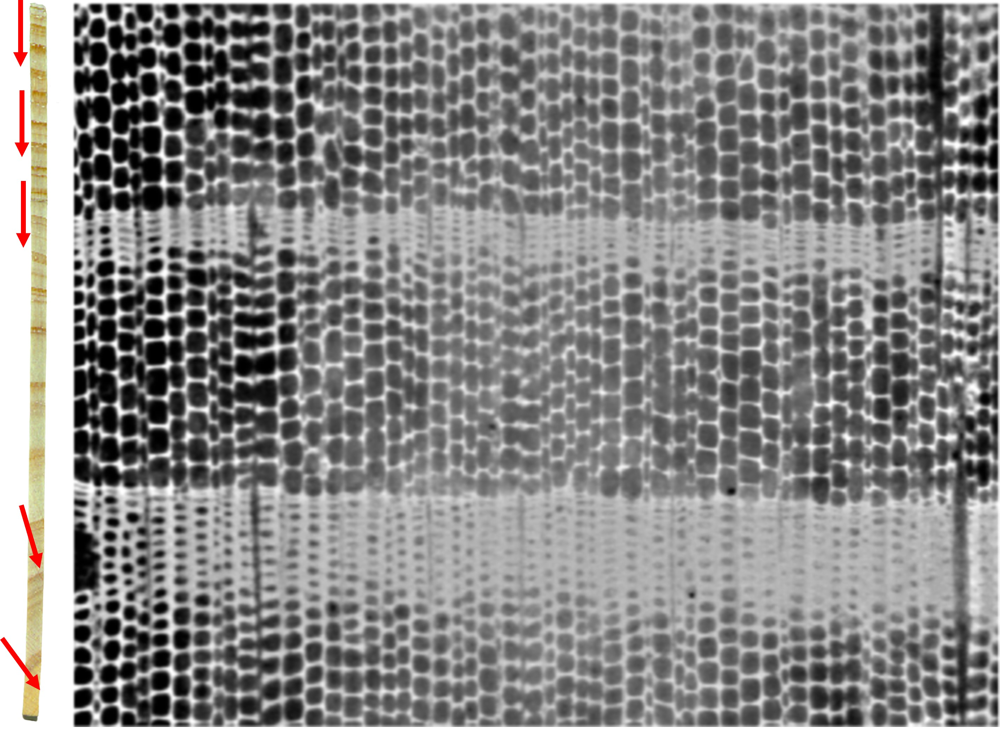

```{=html}
<style>
h1, h2, h3 {
  text-align: left;
}
body {
text-align: justify}
</style>
```

------------------------------------------------------------------------

```{r setup, include=FALSE}
knitr::opts_chunk$set(echo=FALSE, message = FALSE, warning = FALSE)

#options(knitr.table.format = 'html')
options(knitr.table.format = 'latex')

#https://bookdown.org/yihui/rmarkdown-cookbook/hide-one.html
#https://bookdown.org/yihui/rmarkdown-cookbook/n
#Read in Excel worksheet
#
rm(list = ls())    #Clean the work space
library(tidyverse) #Loads ggplot2, tibble, dplyr, readr, purrr, stringr, forcats
library(data.table)
library(readxl)
#library(readODS)
library(distill)  #https://rstudio.github.io/distill/
library(lmodel2) 
library(agricolae)   #For post hoc test
library(kableExtra)
library(glue)
library(graphics)
library(grid)
library(gridExtra)  #grid.arrange
library(ggpubr)     #ggarrange allows common legend for plots
library(maps)
library(mapdata)
library(grDevices)   #For superscripts in caption
#library(drc)        #Michaeilis-Menton curve fitting

#library(shiny)
library(jsonlite)
library(colorRamps) # provides green2red divergent colormap which I like 

source("../R/PlottingFunctions.R")
source("../R/PrepareIntervalData.R")

```

## Abstract {#abstract}

Mature age *P. radiata* trees were sampled across nine sites in northern New South Wales, Australia that were expected, based on site quality and inventory metrics, to exhibit significant variation in productivity and wood quality. Twenty trees per site were harvested and 13mm diameter, pith-to-bark increment cores were extracted from three trees per site from eight of the nine sites. Ouerwood increment cores were collected from all trees for basic density measurement. The same trees were also sampled using an IML PD400 (Resi) instrument.

Radial mean properties of wood basic density derived from Resi traces were found to correlate strongly with the mean density data derived from SilviScan analyses and from increment cores. Resi-derived basic density of 10mm radial segments were strongly correlated with SilviScan measures of basic density averaged at similar intervals.

## Introduction

Over the past few decades the SilviScan technology [@RN1557; @RN1160; @RN1162] has repeatedly demonstrated its capability for generating accurate measures of a wide range of physical wood properties [@RN1615] in samples taken from standing trees. These provide strong correlations with the commercial products sourced from logs [@RN1280]. Basic density, microfibril angle (MfA) and dynamic stiffness (MoE), along with a range of cell dimensional properties (e.g. radial and tangential fibre diameter, fibre wall thickness and fibre coarseness) can rapidly be determined at high radial resolution, with a sampling interval of 25 *u*m (MfA and MoE at 0.2 - 5 mm minimum sampling interval).

The IML PD-series power drill (Resi) is increasingly being accepted as a tool for commercial pre-harvest assessment of stand-average wood quality in Australia. Its rapid, low cost measurement capability, combined with its accuracy and precision for estimating wood density, and its consequent prediction of log stiffness (MoE) has been demonstrated in a range of industry and Forest and Wood Products Australia (FWPA) funded studies [@RN1613; @RN1529; @RN1614; @RN1622]. Its application to tree breeding has also been demonstrated in multiple studies over recent years [@RN1592; @RN1594].

To date, the commercial use of the Resi has focused primarily on estimating the average density of the stem at the point of sampling [@RN1543], with limited attempts to explore the accuracy of the radial assessments at the annual ring or radial segment level [@RN1627]. The commercial objective has been to provide a reliable measure of the wood quality within a forest that is non-destructive and deployable during a standard forest inventory program, from which the value of the sawn timber product from that stand can be inferred with a commercially-useful level of precision.

Radial variation in wood properties is an important component of the overall log quality [@RN1529]. Given that SilviScan represents an accepted standard in wood property assessment, the objective of this study was to compare the basic density estimates generated from Resi traces with those generated by SilviScan, where both Resi and SilviScan data has been derived from effectively the same sampling point in then stem. Resi and SilviScan data were obtained from 22 trees sampled across eight different, mature age radiata pine sites in the northern NSW Oberon region. The radial variation of estimates of MoE were also examined.

## Methods

As part of a larger study [@RN1613], 180 trees were sampled across 9 sites in the Oberon region of northern New South Wales in March 2019 (Table \@ref(tab:SiteInfoTable), Figure \@ref(fig:sitemap)). The sites were selected to represent as broad a range of growth and wood properties as possible within the constraints of available close-to-harvest age plantations in the region and current harvesting operations.

Twenty trees per site were sampled and felled for sawn timber processing to assess the accuracy and precision of pre-harvest measurements based on traces taken using the IML Resi. A Resi trace was collected at breast height from each tree, random with respect to aspect, but avoiding proximity to branch and defects. Traces were collected with a forward speed of 200 cm.min^-1^ and 2500 RPM. A 13mm diameter by 50 mm long outerwood core was sampled close to the sampling location of the Resi trace, to use in calibrating the Resi instruments for basic density estimation. A wooden dowel was inserted into the resultant hole and the tree number recorded on it to assist in identifying the buttlog in the logyard (Figure \@ref(fig:SSsample)) as part of a larger mill trial [@RN1613].

```{r SiteInfoTable, align = "center", out.width="100%"}

tbl1 <- data.table(read_excel("../data/TableData.xlsx", sheet = "Table1"))
tbl1$Site <- c(1:9)
tbl1$Latitude <- round(tbl1$Latitude,2)
tbl1$Longitude <- round(tbl1$Longitude,2)

#kable((tbl1), align = "c", caption = "Pinus radiata field site sampled for SilviScan and Resi analysis." ) %>% kable_classic_2(position = "center", full_width = TRUE, lightable_options = "basic")

#https://haozhu233.github.io/kableExtra/awesome_table_in_pdf.pdf\

#Remove Lat and Lon from table for publication

kbl(tbl1[,-c(11,12)], booktabs = T,  caption = "Site data for SilviScan and Resi analysis", align  = "c") %>%
kable_styling(latex_options = "scale_down", full_width = F) %>%
row_spec(0, angle = 0)

```

<br>

```{r sitemap, fig.cap = "Locations of the nine sample sites in northern NSW, Australia", fig.pos="!H", results = "asis"}
#https://cran.r-project.org/web/packages/maps/maps.pdf

siteLoc <- data.table(tbl1$Site,tbl1$Latitude,tbl1$Longitude)
#site1 <- c(tbl1$Latitude[1],tbl1$Longitude[1])

map("worldHires",xlim=c(148.5,151.5),ylim=c(-34.7,-33.1))
#map.scale(143.5,-45)
map.cities(country="Australia",label=T,minpop=25000,pch=1,cex=1.2)
map.scale(relwidth=0.25,ratio=F,cex=0.8) 

points(siteLoc$V3,siteLoc$V2,pch=18,col="blue")
map.axes(cex.axis=0.8)
#points(site1[2],site1[1],pch=8,col="black")

```

From three trees at each site, selected to cover the range in breast height diameter, a 13 mm diameter full radius core was taken for SilviScan analyses (Figure \@ref(fig:SSsample)). SilviScan and outerwood cores were sampled close to the location sampling point of the first of the pair of Resi traces sampled from each tree (Figure \@ref(fig:DiscImage)).

```{r SSsample, fig.width = 10, fig.align = "left", fig.cap = "Twenty trees were selected as sawlogs from each site. Plugs were inserted in the outerwoood core sampling hole to assist in identifying individual butt logs in the log yard, and on three trees per site full radius cores were taken for SilviScan analyses."}



```

Given the potential for wood properties to vary significantly within a relatively short distance within stems, it is important to sample as close to the same portion of the stem with both the Resi and SilviScan core to obtain optimal comparisons. The slight curvature in the dark line in Figure \@ref(fig:DiscImage) illustrates a potential for the Resi needle to follow a slightly curved trajectory through the tree, as it interacts with the slope of grain and rotation direction of the needle. In most trees the trajectory is quite straight if the Resi instrument is level and the stem is perpendicular. Extreme curvature can be generated if the Resi instrument is angled significantly up or down (i.e. more than 5 degrees). However, in many trees the pith is not in the exact centre and so a perfectly cross-sectional trace through the geometric centre may miss the pith by centimeters.

```{r DiscImage, fig.align = "left", fig.cap = "Disc cross section illustrating the effect on radial length and annual ring count on SilviScan profiles and Resi traces. The white arrow indicates the direct bark-to-pith trajectory obtained from the SilviScan analyses.", out.width="50%"}



```

Of the 24 SilviScan cores collected, 22 full radius cores were sent to FP Innovations in Vancouver, Canada (<https://web.fpinnovations.ca/>) for SilviScan analysis. SilviScan data was returned as radial, pith-to-bark profiles of density, cell diameter (radial and tangential) and wall thickness at a 25 *u*m radial sampling interval. Radial profiles of microfibril angle (MfA) and dynamic modulus of elasticity (MoE) were also measured at a 2mm radial sampling interval. Annual ring means generated using automated ring detection algorithms were also provided. However, these were found to be to inaccurate in most radii (see Figure \@ref(fig:ExampleSSprofile)b).

Resi traces were processed using web-based software (<https://forestquality.shinyapps.io/FWPA-4/>) to prepare radial transects of amplitude for analysis. Annual ring boundary positions were allocated within the traces to generate measures of annual ring mean density and ring width. The web platform cited above has the capability to read the radial profiles of wood properties generated by SilviScan in which annual ring boundaries were manually positioned, to generate annual ring mean properties comparable as much as possible to those generated by Resi.

SilviScan density is air-dry density, not basic density, determined at a moisture content of \~7-8%, derived from the sample conditioning and measurement at a constant 20^o^C and 40% relative humidity. In the analyses reported here, the values were adjusted to approximate basic density using the following calculation from Siau [-@RN1629].

\$Basic density = 1000 \* SilviScan_density / (1080 + coefA \* SilviScan_density)\$

where "coefA" is a coefficient defined to minimise the bias between the SilviScan value and the value of the corresponding outerwood cores.

An important issue in comparing Resi and SilviScan data was the way the SilviScan data were presented. Because the SilviScan analysis included the image analysis of fibre properties, the radial profiles were corrected as if the core had been taken directly towards the pith. This is illustrated in Figure \@ref(fig:DiscImage) as the differences between the yellow line indicating the actual trajectory of the SilviScan core (SS) and the white arrow indicating the corrected trajectory of the data generated. The automated image processing employed by Silviscan, requires the orientation of the rays to be calculated [@RN1557]. Typically the vascular rays in wood are aligned radially, running from pith to bark (Figure \@ref(fig:SSImage)) which gives a ray angle effectively zero degrees at the bark. If the sample misses the pith, the ray angle will progressively increase towards 90 degrees (as indicated by the red arrows) as it passes the pith. From this change in direction, the position of the pith can be estimated and the radial profiles corrected accordingly. This, however, causes issues for comparing between SilviScan and Resi values, especially if either of them misses the pith by a substantial distance (as illustrated in Figure \@ref(fig:DiscImage).

```{r SSImage,fig.align = "left", fig.cap = "A typical surface image used by SilviScan to determine fibre dimensions on the right hand side.  On the left is a SilviScan bark-to-pith strip prepared from the increment core that was missing the pith. The red arrows illustrate the orientation of the rays (and the direction of the pith), that are vertically aligned in the microscope image used by SilviScan. The right hand image from top to bottom represents 1 mm of radial distance.", out.width="70%"}




```

In Figure \@ref(fig:ExampleSSprofile)a, the annual rings were clear, and corresponded well between the Resi trace and SilviScan profiles. In many samples however, (e.g. Figure \@ref(fig:ExampleSSprofile)b) annual ring positions could not be accurately identified. Likewise the lower resolution of the Resi traces also made accurate annual ring detection impossible in many traces. As the main focus of this study was to compare radial wood property variation between SilviScan and Resi traces, only a 5 to 6 of the samples were able to be meaningfully compared using annual ring values.

Consequently, the focus of the analyses presented here was on comparisons undertaken using all samples by generating the means of 10 mm intervals starting from the cambium. A similar approach had been adopted and reported in Gendvilas et al. [-@RN1627] in *Eucalyptus nitens* comparing the radial variation in basic density with that of wood blocks of 20mm radial thickness.

All analyses and reporting was done in R [@RN1623] using RMarkdown [@RN1625] within the RStudio environment [@RN1624].

```{r LoadSilviScan}
#Read in the SS data produced after processing data on the resi web platform.  

rdsData <- readRDS("../data/Oberon Test ssData_09 Sep 2021.ssData")
#names(rdsData)

sNames <- unique(rdsData$profileNames)
ssData <- rdsData$profiles
ssRingData <- rdsData$SilviScanRingMeans

#Look at using FPInnovations equation for converting SS density to basic density.  See it it removes the bias in the 1:1 relationship with Resi.

ssRingData$Site <- paste0("Site-",substr(ssRingData$SampleName,4,4))

#Cycle through the list and collate means
meanSSData <- NULL
for (i in 1:length(sNames)) {
  x        <- ssData[i][[1]]
  meanData <- x[,.(Radius   = max(Posn)
                ,Density = mean(Den)
                ,Rad = mean(Rad)
                ,MFA = mean(MFA)
                ,MOE = mean(MOE)
                )]
  meanData$SampleName <- sNames[i]
  meanSSData <- rbind(meanSSData,meanData) 
}

#rm(meanSSDen)


```

```{r LoadResi, echo=FALSE}
fList <- list.files("../data-Rad/Resi", pattern = ".Resi")
fpath <- as.character(paste0("../data/","FCNSW_HPP_HVP SilviScan study ResiData_ResiValues_10mm.Resi"))
rds <- readRDS(fpath)
#names(rds)

#Extract the HPP data only
sData     <- rds$df[which(rds$df$ResiCode == "PD400-1436")]

pPos  <- sData[1]$EntryRadius*10
czs   <- sData[1]$BarkThickness*10

#Correct the TreeID from Site 1 in the HPP traces
sData$TreeID <- gsub("\\*", "-",sData$TreeID)
sData$TreeID <- gsub("SITE", "HPP-",sData$TreeID)


#### Prepare the resTrace data
tNames <- unique(sData$TreeID)

i <- 1
for (i in 1:length(tNames)) {
  pPos  <- sData[i]$EntryRadius*10
  czs   <- sData[i]$BarkThickness*10
  rCode <- sData[i]$ResiCode
  #trace <- data.table(rev(unlist(rds$denTraces[i])[czs:pPos]))
  trace <- data.table(rev(unlist(rds$resTraces[i])[czs:pPos]))
  pos   <- (c(1:length(trace$V1))/10)
  x     <- cbind(tNames[i],rCode, pos,trace)
  colnames(x) <- c("FileName", "ResiCode" ,"Position", "resTraces")
  ifelse(i == 1, resTraces <- x, resTraces <- (rbind(resTraces,x)))
}

#### Prepare the segment interval data
resiSegments <- rds$ringData[which(rds$ringData$ResiCode == "PD400-1436")]
resiSegments$TreeID <- gsub("\\*", "-", x=resiSegments$TreeID)
resiSegments$TreeID <- gsub("SITE", "HPP-",resiSegments$TreeID)


#Get Trace mean values for the entry radius
meanResiData <- data.table(SampleName   = rds$df$TreeID
                          ,ResiCode    = rds$df$ResiCode
                          ,Density     = as.numeric(rds$df$EntryDensity)
                          ,EntryRadius = as.numeric(rds$df$EntryRadius)
                          ,PrAWV       = as.numeric(rds$df$PrAWV)
                          ,PrMoE       = as.numeric(rds$df$PrMOE)
                          )

meanResiData$SampleName <- gsub("\\*", "-", x=meanResiData$SampleName)
meanResiData$SampleName <- gsub("SITE", "HPP-",meanResiData$SampleName)

meanResiData$Site <- paste0("Site-",substr(meanResiData$SampleName,5,5))


```

## Results and Discussion

### Calibrating the Resi density estimates

From the stem position from which the first Resi trace was collected, a 50mm long, 13 mm diameter outerwood core was sampled in each of 20 trees per site, to develop a calibration relationship between Resi values (% amplitude) and basic density. To simplify the calibration process, protocols have been developed relating the mean resistance values of the outer 50 mm of wood from the entry side of the trace with the corresponding Resi values for those samples. The web processing platform (<https://forestquality.shinyapps.io/FWPA-4/>) facilitates defining the relationship between the relative Resi amplitude values (0-100%) and core basic density. In the relative scale of the Resi values, zero is defined by the resistance experienced within the instrument prior to the needle entering the wood. Maximum resistance is defined as 100% of the torque of both motors minus a safety factor. Previous work has shown that this relationship, at the core mean level is linear [@RN1543].

Mean Resi values for the outer 50 mm underbark were calculated and the regression coefficients for the relationship with core basic density determined (Figure \@ref(fig:ResiCal)a). The fitted regression was defined using standardised major axis (SMA) regression within the "lmodel2" package (<https://cran.r-project.org/package=lmodel2>). These coefficients were used used in the larger study (not reported here) to compare Resi-derived wood properties with the sawn board products from the trees [@RN1613].

The outer 50mm of the SilviScan profile was likewise compared with the basic density of the outerwood cores (Figure \@ref(fig:ResiCal)b), after defining the the value for coefA described in equation 1. A value of 0.414 resulted in minimum bias between the SilviScan and core density values. The corresponding Resi values explained 73% of the variance in the SilviScan values, which increased to 85% if one outlier was ommitted from site 9 data (Figure \@ref(fig:ResiCal)c). This ommission made minimal changes to the slope and intercept of the regression. Comparing the regressions between Figures \@ref(fig:ResiCal)a & c, the relationships were still significantly different.

```{r ResiCal, fig.width=10, fig.height= 10, fig.align='center',fig.cap="The correlation between outerwood core basic density and (a) outerwood Resi values and (b) outerwood SilviScan means was strong. (c) Resi values were likewise strongly correlated with the SilviSCan outerwood values."}

#Read in the datasets required for the calibration process
#       Read in the Actual outerwood density values 
denData <- data.table(read_excel("../data/ThreeResiCalibrationData_2021-10-26.xlsx", sheet = "CalDataforSS_ResiPaper"))
resiCode <- rev(unique(denData$ResiCode))

#Keep only the HPP data
denData <- denData[which(denData$ResiCode == "PD400-1436")]
denData$SampleID <- gsub("_","-",substr(denData$TreeID,5,8))

#Plot the relationships for each instrument to define their slope and intercept
OWR <- as.numeric(denData$OWRv4)
OWD <- denData$BasicDensity
Site <- as.factor(denData$Site)
mod1 <- lm(OWD~OWR)

df <- na.omit(data.table(Group = Site, x = OWR ,y = OWD))
xmn = 10; xmx = 50; ymn = 300; ymx = 600
xLab <- "Mean Resi Amplitude (%)" 
yLab <- "Outerwood Basic Density (kg/m3)"
figA <- FQ_ggplot(df,xLab, yLab, paste("a."), xmn, xmx, ymn, ymx, fit = TRUE, addLegend = T, "Site")

#Add a plot showing the relationship 
int <- 0.414
OWDss            <- ssOWMeans(ssData,int)
OWDss$SampleID   <- gsub("_","-",substr(OWDss$sList,4,8))
dM <- (left_join(OWDss,denData, by = "SampleID"))
mod2 <- lm(OWD~OWR)


x <- as.numeric(dM$OWRv4) 
y <- as.numeric(dM$owDenSS)
diff <- y-x

mod2 <- lm(y~x)
#anova(mod1, mod2)

df <- data.table(Group = as.factor(dM$Site)
                         ,x = x 
                         ,y = y)

xmn = 10; xmx = 50; ymn = 300; ymx = 600
xLab <- "Mean Resi Amplitude (%)" 
yLab <- "SilviScan OW Density (kg/m3)"

figC <- FQ_ggplot(df[-20,],xLab, yLab, paste("c."), xmn, xmx, ymn, ymx, fit = TRUE, addLegend = f, "Site")
#figB <- FQ_ggplot(df,xLab, yLab, paste("b."), xmn, xmx, ymn, ymx, fit = TRUE, addLegend = f, "Site")

#Add a plot showing the relationship between the OWD cores and SS OWD
#       Pickout the OWD data from the 180 OWD core data


dM <- na.omit(left_join(OWDss,denData, by = "SampleID"))  #Too many missing basic density values

x    <- as.numeric(dM$BasicDensity) 
y    <- as.numeric(dM$owDenSS)
#print(paste("Mean diff in density = ",diff <- mean(y-x)))

df <- na.omit(data.table(Group = as.factor(dM$Site), y = as.numeric(dM$owDenSS) ,x = dM$BasicDensity))
xmn = 300; xmx = 600; ymn = 300; ymx = 600
yLab <- " "
xLab <- "SilviScan OW Density (kg/m3)"
figB <- FQ_ggplot(df,xLab, yLab, paste("b."), xmn, xmx, ymn, ymx, fit = FALSE, addLegend = T, "Site")

ggarrange(figA, figB, figC, ncol=2, nrow = 2, common.legend = TRUE, legend="bottom")


```

### Comparison of Resi and SilviScan radius mean values

The length of the stem breast height radius determined from the length of the SilviScan profile and the pith-to-bark length of the Resi trace were strongly correlated (r^2^ = 0.86) (Figure \@ref(fig:PlotMeans)a). The radius obtained from the length of the SilviScan profile tended to be shorter than that of the Resi data owing to the ray angle correction in the SilviScan data described above. The mean density of the SilviScan profile and Resi trace were also strongly correlated ( r^2^ = 0.60, Figure \@ref(fig:PlotMeans)b).

```{r PlotMeans,  fig.width=10, fig.height= 5, fig.align='center',fig.cap="SilviScan sample length (a) and basic density (b) was strongly correlated with the pith-to-bark length and mean resistance determined from the Resi trace."}

#results = "asis",

#Compare SS vs resi at the sample mean level
#
 #Need to adapt this for the three Resi data sets.  Basically the three Resi sets need to be merged with the resiCodee SS means with group delineating the Resis.  This probably needs to be preceded with the Resi to core density relationships and make sure they have been processed with the correct coefficients.

#Merge the data

#adjSS <- 0.78


meanSSData$sampleCode <- substring(meanSSData$SampleName,4,7)
meanResiData$sampleCode <- substring(meanResiData$SampleName,5,8)

merged.data <- merge(meanSSData,meanResiData, by = "sampleCode")
resiCode <- rev(sort(unique(merged.data$ResiCode)))

#Adjust the SS density to basic density
#   From Tessie Tong 
#   Db=1000 x D8 / (1080+0.22xD8)#

D8 <- merged.data$Density.x
merged.data$Density.x <- 1000 * D8 / (1080+0.414*D8)


### Plot the different Resi data sets, "Site"

y <- merged.data$Radius[which(merged.data$ResiCode == resiCode[1])]
x <- merged.data$EntryRadius[which(merged.data$ResiCode == resiCode[1])]
Group <- as.factor(merged.data$Site[which(merged.data$ResiCode == resiCode[1])])

df <- na.omit(data.table(Group = Group, x = x ,y = y))
xmn = 50; xmx = 250; ymn = 50; ymx = 250
yLab <- "SilviScan radial length (mm)"
xLab <- "IML Resi radial length (mm)"
figA <- FQ_ggplot(df,xLab, yLab, paste("a."), xmn, xmx, ymn, ymx, fit = FALSE, addLegend = T, "")


y <- merged.data$Density.x[which(merged.data$ResiCode == resiCode[1])]
x <- merged.data$Density.y[which(merged.data$ResiCode == resiCode[1])]
#Back calculating the Resi values from the basic density prediction using the slope and intercept in the previous figure
#x <- (x-197.32)/9.4735

Group <- as.factor(merged.data$Site[which(merged.data$ResiCode == resiCode[1])])

df <- na.omit(data.table(Group = Group, x = x ,y = y))
xmn = 15; xmx = 35; ymn = 300; ymx = 600
yLab <- "SilviScan density (kg/m3)"
xLab <- "Mean Resi amplitude (%)"
figB <- FQ_ggplot(df,xLab, yLab, "b.", xmn, xmx, ymn, ymx, fit = TRUE, addLegend = T,"")

ggarrange(figA,figB,ncol=2, nrow=1, common.legend = TRUE, legend="bottom")

rm(figA,figB)


```

### Comparing radial segment means

As a result of the pith-to-bark alignment adjustments made to SilviScan profiles, ring widths determined from SilviScan profiles are more accurate than those obtained from Resi to the degree to which the Resi trace misses the pith. The effect is more marked in the wider, more curved rings of the juvenile core (e.g. asterisk in Figure \@ref(fig:DiscImage)), and minimal in the narrower mature wood rings.

In order to compare annual ring means it is necessary to ensure that the annual ring data represents the same growth year in both the SilviScan data and the Resi data. This requires that annual ring boundaries be clearly resolved and accurately allocated to the year of growth they represent. This is most reliable in the SilviScan data resulting from the higher resolution (25 *u*m sampling interval), combined with the pith-to-bark adjustment of the traces and the ability to adjust the x-ray densitometry such that the x-ray path alignment is parallel to growth ring boundaries [@RN1162]. However, even in the SilviScan data from some samples, ring widths were sufficiently narrow or indistinct to make this impossible to do with certainty (e.g. Figure \@ref(fig:ExampleSSprofile)b).

```{r ExampleSSprofile, fig.width=10, fig.height= 7, fig.cap="Narrow and false ring structures made accurate annual ring detection impossible in many samples, especially in the lower resolution Resi (upper red) traces compared to the SilviScan (lower blue) profiles. Blue vertical lines indicate annual ring positions allocated in SilviScan profiles"}

par(mar=c(2,2,3,2))
par(oma = c(3,3,1,3))
nc <- 1
nr <- 2 #as.integer(25/nc)
par(mfrow = c(nr,nc))
  
pPos.SS <- c(8,8,0,2,0,6,0,6,2,7,2,3,1,0,0,0,2,16,0,0,6,0)
HPPpPos.Resi <- c(-5,12,3,7,22,2,0,-7,2,3,8,3,4,-7,5,8,8,-15,-7,3,0,2)

#n <- 2
i <- 1
tC <- c(1,9)
tNames <- unique(resTraces$FileName)
n <- length(tNames)
figLetter <- c("a.","b.")

for (i in 1:2) {
  j <- tC[i]
  rName <- tNames[j]
  sName <- paste0("GD",substring(rName,4,8)) 
  x <- which(resTraces$FileName == rName)
  resi <- resTraces[x]
  #ss   <- ssData[which(ssData$SampleName == sNames[j])]
  a <- which(sNames == sName)
  ss  <- (ssData[a][[1]])
  
  
  ssRingPos   <- as.numeric(ssRingData$RingPosition[which(ssRingData$SampleName == sName)])+pPos.SS[j]
  resiRingPos <- as.numeric(resiSegments$RingPosition[which(resiSegments$TreeID == rName)])+HPPpPos.Resi[j]
  
  #Fit a regression line to the rayangle to see when it becomes 90 degrees (i.e. passes the pith)
  #df   <- data.frame(pos = ss$Position, angle = 90-abs(ss$RayAngle))
  #order = 4
  #mod <- lm(angle~stats::poly(pos, order), data = df) 
  #summary(mod)
  #y1 <- data.frame(pos = c(-300:100))   #Create an array of position values to identify zero                                                          i.e. a ray angle of 90 degrees where the profile passes the pith
  #j <- stats::predict(mod,y1)
  #pPos <- max(-25,mean(which(abs(j) < min(abs(j))+1))-300)   #define the approximate position of the pith
  
  #https://davetang.org/muse/2013/05/09/on-curve-fitting/
  #https://www.dataquest.io/blog/statistical-learning-for-predictive-modeling-r/
  
  x <- ss$Posn+pPos.SS[j]
  plot(x, ss$Den, type = "l", col = "blue"
     ,ylim=c(250,1500), xlim=c(0,max(x)), axes = FALSE)
  abline(v= ssRingPos, lty=3, col = "blue", ylim = c(0:1000))
  axis(side = 1, at = pretty(range(x)))
  #axis(side = 2, at = pretty(range(ss$Density)))
  axis(side = 2, at = c(250,500,750,1000))
  #rPosLine <- numeric(length(x))
  #rPosLine[as.integer(ssRingPos*40+pPos.SS[i])] <- 1000
  #points(x,rPosLine, col = "blue", lty = 3)
  #

  #par(new = TRUE) 
  #plot(x, 90-abs(ss$RayAngle), type = "l", col = "green"
  #   ,ylim=c(0,180), xlim=c(0,max(x)), axes = FALSE)
  #abline(h = 0, col = "green", lty = 2)
  #axis(side = 4, at = pretty(range(c(0,90))))
  #mtext("Ray Angle (deg)", side = 4, line = 3, adj = 0.5, col = "green") 
  
  if (i == 1) mtext(expression(paste("SilviScan density (kg/m",m^3 ,")")), side = 2, line = 1, adj = 0.5, col = "blue", outer = TRUE, cex = 1.2)  

  par(new = TRUE) 
  x <- resi$Position+HPPpPos.Resi[j]
  plot(x, resi$resTraces, type = "l", col = "red"
     ,ylim=c(-30,40),xlim=c(0,max(x)),axes = FALSE)
  abline(h= 10, lty=3, col = "red")

  axis(side = 3, at = pretty(range(x)), col = "black")
  #axis(side = 4, at = pretty(range(resi$resTraces)))      # Add second axis
  axis(side = 4, at = c(10,20,30,40) )     # Add second axis
  if (i == 1) mtext("Resi amplitude (%)", side = 4, line = 1, adj = 0.5, col = "red", outer = TRUE, cex = 1.2)             # Add second axis label
  mtext(paste(figLetter[i], tNames[j]), side = 3, line = -1.5, adj=.05, cex=1.5)
  
  if (i == 2) mtext("Distance from pith (mm)", side = 1, line = 2.2, adj = 0.5, col = "black")
}

#rm(resi,hppInst,hppRes,HPPpPos.Resi,hvpInst,hvpRes,nswInst,nswRes)

```

In many samples the alignment of ring boundaries was a problem in the early juvenile rings. In many Resi traces (e.g. Figure \@ref(fig:ExampleSSprofile)b) the coarser resolution of the data made it impossible to clearly resolve narrow annual ring boundaries in the mature wood. Consequently meaningful comparisons between annual ring means could not be made on a sufficient number of samples where rings could be confidently identified and cross-matched between the Resi and SilviScan data sets.

```{r TraceComparison, fig.width=9, fig.height= 11, fig.align='center',fig.cap = "SilviScan and Resi traces plotted adjacent to each other illustrate the effect on the clarity of annual ring structures as affected by the different sampling intervals used (SS: .025 mm vs Resi 0.1 mm). The alignment of the tracees was adjusted from the pith end to attempt to correct, as much as possible for the extent of missing the pith.  However, the effect of slight differences in trajectory, ring curvature and the direct pith-to-bark alignment of the SilviScan profiles make perfect alignment impossible for most of the samples.", eval = FALSE}
#Plot the Resi and SS data together trying to work out the best way to compare.
#Will need annual ring positions from both SS data and resi data
#Also plot the Ray angle from the SS data to show how far the core misses the pith
#

### Comparing 10mm segment means 

par(mar=c(3,3,3,2))
par(oma = c(1,5,1,2))
nc <- 1
nr <- 4 #as.integer(25/nc)
par(mfrow = c(nr,nc))
  
i <- 1
pPos.SS <- c(8,8,0,2,0,6,0,6,2,7,2,3,1,0,0,0,2,16,0,0,6,0)
pPos.Resi <- c(-5,12,3,7,22,2,0,-7,2,3,8,3,4,-7,5,8,8,-15,-7,3,0,2)
#n <- length(tNames)

label <- c("a.", "b.", "c." , "d.")
plotTrees <- c(9,11,16,22)
n <- length(plotTrees)
#n <- 2
j <- 4
i <- 1
for (i in 1:n) {
  j <- plotTrees[i]
  x <- which(resTraces$FileName == tNames[j])
  resi <- resTraces[x]
### Comparing 20mm segment means  
  ss  <- (ssData[j][[1]])
  
  ssRingPos   <- as.numeric(ssRingData$RingPosition[which(ssRingData$SampleName == sNames[j])])+pPos.SS[j]
  resiRingPos <- as.numeric(resiSegments$RingPosition[which(resiSegments$TreeID == tNames[j])])+pPos.Resi[j]
  
  #Fit a regression line to the rayangle to see when it becomes 90 degrees (i.e. passes the pith)
  #df   <- data.frame(pos = ss$Position, angle = 90-abs(ss$RayAngle))
  #order = 4
  #mod <- lm(angle~stats::poly(pos, order), data = df) 
  #summary(mod)
  #y1 <- data.frame(pos = c(-300:100))   #Create an array of position values to identify zero                                                          i.e. a ray angle of 90 degrees where the profile passes the pith
  #j <- stats::predict(mod,y1)
  #pPos <- max(-25,mean(which(abs(j) < min(abs(j))+1))-300)   #define the approximate position of the pith
  
  #https://davetang.org/muse/2013/05/09/on-curve-fitting/
  #https://www.dataquest.io/blog/statistical-learning-for-predictive-modeling-r/

  x <- ss$Posn+pPos.SS[j]
  y <- 1000 * ss$Den / (1080+0.22* ss$Den)#
  plot(x, y, type = "l", col = "blue"
     ,ylim=c(200,1400), xlim=c(0,max(x)), axes = FALSE)
  
  axis(side = 1, at = pretty(range(x)))
  axis(side = 2, at = pretty(range(ss$Den)), by = 10)
  abline(v= ssRingPos, lty=3, col = "blue", ylim = c(0:1000))
  #rPosLine <- numeric(length(x))
  #rPosLine[as.integer(ssRingPos*40+pPos.SS[i])] <- 1000
  #points(x,rPosLine, col = "blue", lty = 3)
  #

  #par(new = TRUE) 
  #plot(x, 90-abs(ss$RayAngle), type = "l", col = "green"
  #   ,ylim=c(0,180), xlim=c(0,max(x)), axes = FALSE)
  #abline(h = 0, col = "green", lty = 2)
  #axis(side = 4, at = pretty(range(c(0,90))))
  #mtext("Ray Angle (deg)", side = 4, line = 3, adj = 0.1, col = "green") 
  
  if (i == 1) {
### Comparing 20mm segment means  
    mtext("SilviScan basic density (kg/m3)", side = 2, line = 1, adj = 0.5, col = "blue", outer = TRUE) 
    mtext("Resi values (%)", side = 4, line = 1, adj = 0.5, col = "red", outer = TRUE)             # Add second axis label
  }

  par(new = TRUE) 
  x <- resi$Position+pPos.Resi[j]
  plot(x, resi$resTraces, type = "l", col = "red"
     ,ylim=c(-30,40),xlim=c(0,max(x)),axes = FALSE)
  #abline(v= resiRingPos, lty=3, col = "red")
 
  axis(side = 3, at = pretty(range(x)))
  axis(side = 4, at = c(0,20,40))      # Add second axis
  
  mtext(label[i], side = 3, line = 2, adj=.05, cex = 1.5)
  mtext(tNames[j], side = 3, line = -2, adj=.05, cex = 1.0)
  
  rm(j)
}


```

Consequently the predicted mean basic density of 10mm radial segments were calculated from each of the Resi and SilviScan data starting from the bark and working towards the pith. To reduce the sampling error effect of misalignment between the SilviScan and Resi data, only the segments from the first 100 mm from the bark (first 10 segments) were considered, as the sample depth at higher segment numbers, combined with the "close-to-pith" alignment issues, made comparisons unreliable. For most radii 100 mm from the bark extended well into the juvenile core.

The Resi values explained 70% of the variance in the SilviScan values (Figure \@ref(fig:intervalComparison)a), 63% if eleven outliers, (defined as where the variance between the Resi and SilviScan means exceeded 70 kg.m^-3^) were not removed. These outliers were predominantly segments closer to the pith. The explained variance increased several more percent using 20 or 25 mm segments, rather than 10 mm, as the net effect of misalignment between the Resi and SilviScan data reduced (data not shown). The Resi-predicted density values were subtracted from the SilviScan values to calculate the difference. The first segment tended to exhibit a lower density value in the Resi data (Figure \@ref(fig:intervalComparison)b).

```{r intervalComparison, fig.width=10, fig.height = 6, fig.align = "center", fig.cap = "(a) The mean Resi-predicted density of 20 mm segments was compared to the SilviScan density values for each Resi instrument. (b) The effect of distance from the cambium on the difference between SilviScan and Resi mean basic density."}
#Explore the comparison of the mean of 10mm intervals from the bark instead of ring means
#https://shiny.rstudio.com/articles/interactive-docs.html
int <- 100
intervalMeans <- NULL

#### Prepare the SilviScan Segment means
rNames <- unique(resiSegments$FileName)
ssSegments <- ssSegmentMeans(int,ssData,rNames,10) #in PrepareIntervalData.R
ssSegments$SegmentName <- paste0(ssSegments$SampleName,"-",ssSegments$Intervals)
D8 <- ssSegments$Den
ssSegments$SSBasicDensity <- 1000 * D8 / (1080+0.414*D8)

    #Remove segments GT 6 as these are typically the most misaligned
#ssSegments <- ssSegments[which(ssSegments$Intervals < 6)] 

#### Prepare the Resi Segment means
#resiSegments <- resiSegments

resiSegments$SampleName <- substr(resiSegments$TreeID,5,8)
resiSegments$SegmentName <- paste0(resiSegments$SampleName,"-",resiSegments$RingFromBark)
#resiSegments$Company <- substr(resiSegments$TreeID,1,3)
 
#CALCULATE THE DISTANCE FROM THE START OF THE TRACE
#   Get the bark thickness data
bark <- sData[,c(2,9)]
resiSegments <- right_join(resiSegments,bark, by = "TreeID")

#### Merge the SS and Resi means
rm(DT)
DT                    <- merge(ssSegments,resiSegments, by = "SegmentName")
DT$PrSSDen            <- fitted(lm(SSBasicDensity~RingDensityMean, data = DT))
DT$Diff               <- DT$PrSSDen-DT$SSBasicDensity
DT$DistanceFromCambium  <- DT$Intervals * int/10 - int/20
DT$DistanceFromEntry  <- DT$BarkThickness + DT$DistanceFromCambium

#remove outliers where Diff is GT 70
ii <- which(abs(DT$Diff) > 70)
#DT$Intervals[ii]
DT <- DT[-ii,]


###### Combine the resi seghment data and plot with Group = Resicode
y <- DT$SSBasicDensity
x <- DT$PrSSDen
Group <- as.factor(DT$Interval)

df <- na.omit(data.table(Group = Group, x = x ,y = y))
xmn = 300; xmx = 600; ymn = 300; ymx = 600
yLab <- expression(paste("SilviScan basic density (kg/",m^3 ,")"))
xLab <- expression(paste("Resi basic density (kg/",m^3 ,")"))
  
figA <- FQ_ggplot(df,xLab, yLab, "a.", xmn, xmx, ymn, ymx, fit = TRUE, addLegend = T,"Segment")


#Prepare the bar plot by segment
p <- ggplot(DT, aes(as.factor(DistanceFromCambium), Diff, color = ResiCode))+
    #annotate("text",x = 1, y = 100,label = "b.")
    geom_text(label="b", x=1, y=90, cex = 6)
    
  
figB <- p + 
    geom_boxplot(fill = "white", colour = "#3366FF", outlier.colour = "red",outlier.alpha = 0.1)+
    ylim(c(-75,75))+
    geom_jitter(width = 0.1, colour = "blue")+
    theme_light()+ 
    theme(text = element_text(size = 14)
          ,panel.grid.major = element_line(colour = "light grey", size = 0.1)
          ,panel.grid.minor = element_blank()) +
    annotation_custom(textGrob("b", x=0.01, y=0.89, hjust=0, gp=gpar(fontsize = 16, fontface="bold")))+
    ylab("Resi minus SilviScan density (kg/m3)")+xlab("Distance from cambium (mm)")
  
ggarrange(figA,figB,ncol=2, nrow=1, common.legend = TRUE, legend="bottom")
  


rm(figA, figB, p)
```

### Baseline correction of Resi traces

A noted feature of the Resi trace is the presence of resistance on the needle after it exits the tree on the opposite side . This is attributable in large part to friction on the 1.5 mm diameter needle shaft resulting from drill chips accumulating from the cutting edge. Many analyses involving resistance drilling [e.g. @RN1613; @RN1543; @RN1591] employ a linear baseline correction which assumes the linear accumulation of friction (resistance) from the beginning of the trace to the point of exit. The measurement of the magnitude of the resistance can be calculated and corrected after the needle exits the stem or log. However, given the shape of the cutting head of the needle and the radial variation in wood anatomy, chemistry, basic density and growth stresses within the tree, it is unlikely that the baseline correction is strictly linear. Previous work [@RN1622] had identified that the first 28-30 mm of the Resi trace tended to under estimate the basic density if a linear baseline correction was employed. Thus the under-prediction of the first segment (Figure \@ref(fig:intervalComparison)b) and the possible tendency for subsequent values to be over-predicted is important to quantify and in some applications, correct for.

An additional aspect for investigation is the effect of bark thickness on the non-linear corrections. @RN1622 used discs with bark removed, thus the Resi traces started in wood immediately beneath the cambium. The Resi traces collected here were on standing trees so that bark effects may be a contributing factor. The radial pattern of the density differences for this study were examined when bark thickness was added to the segment data (Figure \@ref(fig:intervalComparisonNonLinear)a) and a logarithmic model fitted to the relationship as defined below.

```{=tex}
\begin{equation} 
BasicDensityAdjustment = -71.0 + 18.17 * ln("distance-from-entry")
(\#eq:model)
\end{equation}
```
Adjusting the Resi-derived basic density data using equation \@ref(eq:model) increased the variance explained to 74% (Figure \@ref(fig:intervalComparisonNonLinear)b) and removed the under-prediction of basic density in the first segment (Figure \@ref(fig:intervalComparisonNonLinear)c). Based on the equation \@ref(eq:model) the adjustment became zero at around 50mm from the start of the Resi trace. Given the variation in bark thickness, the contrast between bark density and wood density and consequent effects on needle friction, the degree to which this effect should be accounted for requires further investigation.

```{r intervalComparisonNonLinear, echo=FALSE, fig.height=9, fig.width=10, fig.align='center', fig.cap="(a) (b) mean corrected Resi-predicted density of 20 mm segments compared to the SilviScan density values (c) "}


x <- DT$DistanceFromEntry
y <- DT$Diff
#y[which(DT$DistanceFromEntry > 80)] = 0

df <- na.omit(data.table(Group = as.factor(DT$Intervals), x = x ,y = y))
xmn = 0; xmx = 120; ymn = -80; ymx = 80
yLab <- expression(paste("Density difference (kg/",m^3 ,")"))
xLab <- "Distance from Entry ( mm)"
figA <- FQ_ggplot_GENERIC(df,xLab, yLab, "b.", xmn, xmx, ymn, ymx, fit = FALSE, addLegend = F, "Segment")

#Fit a nonlinear model to figA+
mod <- lm(y~log(x))
#summary(mod)
a <- predict(mod)

#Basic_Density_Adjustment = -75.913 + 19.447 * log("distance-from-origin")

pred <- data.table(cbind(x,a))

#figA <- figA + geom_point(data=pred, aes(x, a))
#pred <- data.table(cbind(x=pos,a = a1))
figA <- figA + geom_line(data=pred, aes(x, a), col = "red")


#Plot the overall relationship with log corr
DT$RingDensityMeanCorr     <- as.numeric(DT$PrSSDen)-a
y     <- as.numeric(DT$SSBasicDensity)
x     <- as.numeric(DT$RingDensityMeanCorr)
Group <- as.factor(DT$Interval)

#summary(lm(y~x))   #"0+" suppresses the fitting of the intercept
#summary(lm(y~0+x)) #but r2 seems to assume (0,0) is part of the equation
#predict(lm(y~0+x))
#cor(x,y)^2
#cor(predict(lm(y~0+x)),y)^2

#https://data-hacks.com/r-set-fixed-intercept-linear-regression-model
#x <- DT$RingDensityMean
#y <- DT$SSBasicDensity
#my_intercept <- 225               # Estimating model with fixed intercept
#normMod <- lm(y ~ x)
#fixedMod <- lm(I(y - my_intercept) ~ 0 + x)
#summary(normMod)
#summary(fixedMod)

df <- na.omit(data.table(Group = Group, x = x ,y = y)) 
xmn = 300; xmx = 600; ymn = 300; ymx = 600
yLab <- expression(paste("SilviScan basic density (kg/", m^3 ,")"))
xLab <- expression(paste("Resi basic density (kg/",m^3 ,")"))

figB <- FQ_ggplot_NoSEP(df,xLab, yLab, "b.", xmn, xmx, ymn, ymx, fit = FALSE, addLegend = F, "Segment")


DT$newDiff <- DT$RingDensityMeanCorr-DT$SSBasicDensity
p <- ggplot(DT, aes(as.factor(DistanceFromCambium), newDiff))+
  #annotate("text",x = 1, y = 100,label = "b.")
  geom_text(label="b", x=1, y=90, cex = 6) +
  xlab("Distance from entry (mm)") +
  ylab("Density difference (kg/m3)")

figC <- p + geom_boxplot(fill = "white", colour = "#3366FF", outlier.colour = "red",outlier.alpha = 0.1         
                         ,show.legend = FALSE)+ylim(c(-50,50))+
  geom_jitter(width = 0.1, colour = "blue")+
  theme_light()+ 
  theme(text = element_text(size = 14), panel.grid.major = element_line(colour = "light grey", size = 0.1), panel.grid.minor = element_blank()) 

figC <- figC+annotation_custom(textGrob("c.", x=0.05, y=0.95, hjust=0, gp=gpar(fontsize = 16, col = "black")))


grid.arrange(figA, figB, figC,ncol=2)


```

### Comparisons with other wood properties

SilviScan has the ability to measure a range of wood properties directly (e.g. density, radial and tangential cell diameter, and microfibril angle (MfA)) and indirectly (e.g. dynamic MoE, fibre wall thickness, fibre coarseness and specific surface area). Resi measures turning resistance which is strongly correlated with basic density.

At the radial mean level, Resi amplitude explained only 15% of the variance in SilviScan dynamic MoE (data not shown). However at the segment mean level, baseline corrected Resi basic density explained 68% of the variance in the segment mean MoE (Figure \@ref(fig:MeanMoEComparison)a), 66% of the variance in fibre wall thickness (Figure \@ref(fig:MeanMoEComparison)c) and 43% of the variance in fibre coarseness (Figure \@ref(fig:MeanMoEComparison)d). While there is no obvious reason why Resi amplitude would be affected by microfibril angle variation, through co-linearity between MFA and density, Resi predicted density explained 55% of the variance in the inverse of MfA (Figure \@ref(fig:MeanMoEComparison)b). The inverse of MfA resulted in a more normal distribution, increasing the variance explained, compared to the untransformed state. In looking at the variance in Resi basic density and MfA within segments furthest from the bark (segments 9 & 10), it was evident that relationship progressively disappeared as one got closer to the pith.

```{r MeanMoEComparison, fig.width = 10, fig.height = 10, fig.cap = "Resi corrected density was strongly correlated with (a) Silviscan MoE, (b) MfA, (c) tracheid wall thickness and (d) fibre coarseness."}

#First up compare the non-linear segment means from Resi density with SS wall thickness, MfA, MoE, Coarseness.  The MfA and diffIntens relationships are important as they will help explain in part why theREsi MoE and SSMoE relationship is not 1:1.
#
y <- merged.data$MOE
x <- merged.data$Density.y * 13.0+158  
Group <- as.factor(merged.data$Site)

df <- na.omit(data.table(Group = Group, x = x ,y = y))
xmn = 300; xmx = 600; ymn = 0; ymx = 20
yLab <- "SilviScan dynamic MoE (GPa)"
#xLab <- "Resi predicted basic density (kg/m3)"
xLab <- ""
#figA <- FQ_ggplot_NoSEP(df,xLab, yLab, "a.", xmn, xmx, ymn, ymx, fit = TRUE, addLegend = T,"")

#Look at the relationship at the segment level
y <- DT$MOE
#x <- DT$RingDensityMean
x <- as.numeric(DT$RingDensityMeanCorr)
#x <- DT$RingDensityCV  
Group <- as.factor(DT$Intervals)

df <- na.omit(data.table(Group = Group, x = x ,y = y))
xmn = 300; xmx = 600; ymn = 0; ymx = 20
yLab <- "SilviScan dynamic MoE (GPa)"
#xLab <- "Resi mean amplitude (%)"
figA <- FQ_ggplot_NoSEP(df,xLab, yLab, "a.", xmn, xmx, ymn, ymx, fit = TRUE, addLegend = F,"")


#extract each segemnt and fit a line to it
nCol <- blue2green(10)
for (i in 1:length(unique(df$Group))) {
    x1 <- df$x[which(df$Group == i)]
    y1 <- df$y[which(df$Group == i)]
    summary(lm(y1~x1))
    cf <- coef(lm(y1~x1))
    ft <- fitted(lm(y1~x1))
    
    if (i == 2 | i == 10) {
        figA <- figA + geom_abline(slope = cf[2], intercept = cf[1], color = nCol[i], lty = 1)
    }
}

#Relationship with MFA
#y <- 1/DT$MFA
#x <- DT$RingDensityCV  
y <- DT$MFA
Group <- as.factor(DT$Intervals)

df <- na.omit(data.table(Group = Group, x = x ,y = y))
#xmn = 10; xmx = 40; 
#ymn = 0; ymx = 0.25
ymn = 0; ymx = 50
yLab <- "SilviScan MfA (degrees)"
#xLab <- "Resi mean amplitude (%)"
figB <- FQ_ggplot_NoSEP(df,xLab, yLab, "b.", xmn, xmx, ymn, ymx, fit = TRUE, addLegend = F,"")

#extract each segemnt and fit a line to it
nCol <- blue2green(10)
for (i in 1:length(unique(df$Group))) {
    x1 <- df$x[which(df$Group == i)]
    y1 <- df$y[which(df$Group == i)]
    summary(lm(y1~x1))
    cf <- coef(lm(y1~x1))
    ft <- fitted(lm(y1~x1))
    
    if (i == 2 | i == 10) {
        figB <- figB + geom_abline(slope = cf[2], intercept = cf[1], color = nCol[i], lty = 1)
    }
}


#Relationship with Wall thickness
y <- DT$Wall
Group <- as.factor(DT$Intervals)

df <- na.omit(data.table(Group = Group, x = x ,y = y))
#xmn = 10; xmx = 40; 
ymn = 1; ymx = 5
yLab <- "SilviScan tracheid wall thickness (um)"
xLab <- expression(paste("Resi corrected basic density (kg/",m^3 ,")"))

figC <- FQ_ggplot_NoSEP(df,xLab, yLab, "c.", xmn, xmx, ymn, ymx, fit = TRUE, addLegend = T,"Segment")

#Relationship with CRS
y <- DT$Crs
Group <- as.factor(DT$Intervals)

df <- na.omit(data.table(Group = Group, x = x ,y = y))
#xmn = 10; xmx = 40; 
ymn = 200; ymx = 800
yLab <- "SilviScan fibre coarseness (ug/m)"
xLab <- expression(paste("Resi corrected basic density (kg/",m^3 ,")"))

figD <- FQ_ggplot_NoSEP(df,xLab, yLab, "d.", xmn, xmx, ymn, ymx, fit = TRUE, addLegend = T,"Segment")

ggarrange(figA,figB,figC,figD, ncol=2, nrow=2, common.legend = TRUE, legend="bottom")
#ggarrange(figList$figB, figList$figE, ncol=2, nrow=1, common.legend = TRUE, legend="bottom")


rm(figList)

```

MoE is predominantly a function of density and MfA. In mature wood closer to the bark, the MfA is typically lower and MoE is predominantly driven by basic density. In contrast in juvenile wood closer to the pith, MoE is more dependent upon MfA.

Segment mean MoE was predicted from the Resi amplitude mean using the relationship defined in Figure \@ref(fig:MeanMoEComparison)a. Resi predicted MoE explained 68% of the SilviScan values (Figure \@ref(fig:MoeDiffPlot)a). As mentioned above, the relationship between the Resi-derived values and the SilviScan MoE was stronger in the segments close to the bark and weak to non-existent in the segments closer to the pith.

Comparing the SilviScan MoE and MfA values (Figure \@ref(fig:MoeDiffPlot)b) demonstrates a reverse relationship with segments closer to the pith being more strongly dependent upon MfA. This is more evident in comparing SilviScan MfA with Resi predicted MoE (Figure \@ref(fig:MoeDiffPlot)c) where for a given MfA value there is a wide range of Resi MoE values in the close to pith segments; much more so than within the close-to-bark segments. The regression of the relationship between the MfA and MoE in Figure \@ref(fig:MoeDiffPlot)b&c is plotted for segment 2 and 9 illustrating the change in the dependence of MoE on MfA in these radial positions. This was supported by plotting the difference in the segment mean MoE predictions from Resi and SilviScan against inverse MfA (Figure \@ref(fig:MoeDiffPlot)d).

```{r MoeDiffPlot, fig.height = 10, fig.width=10, fig.cap="(a) Resi-predicted MoE correaltion with SilviScan MoE. MFA explains more of the SilviScan MoE (b) and resi -predicted MoE (c) variance in segments furthest from the bark. (d) MfA variation with the difference between the Resi and SS MoE values where the SilviScan MoE values are derived from both density and MfA. in b-d the solid lines illustrate the regression relationship for segments 1 and 9. "}
# develop Jon's idea of looking at the MFA relationship with the difference between the SSMoE and the PrMoE to support the view that MfA is driving the effect.

#names(DT)
#Use relationship in FigB to predict MoE
PrMOE <- DT$RingDensityMeanCorr * 0.1283 - 41.201
#Get the difference between SSMOe and Resi PrMOE

x     <- PrMOE
y     <- DT$MOE
group <- DT$RingFromBark

df <- na.omit(data.table(Group = Group, x = x ,y = y))
xmn = 0; xmx = 20; ymn = 0; ymx = 20
yLab <- "SSMoE (GPa)"
xLab <- "ResiMoE (GPa)"
figA <- FQ_ggplot_NoSEP(df,xLab, yLab, "a.", xmn, xmx, ymn, ymx, fit = FALSE, addLegend = T, "Segment")

#extract each segemnt and fit a line to it
nCol <- blue2green(10)
for (i in 1:length(unique(df$Group))) {
    x1 <- df$x[which(df$Group == i)]
    y1 <- df$y[which(df$Group == i)]
    summary(lm(y1~x1))
    cf <- coef(lm(y1~x1))
    ft <- fitted(lm(y1~x1))
    
    if (i == 1 | i == 9) {
        figA <- figA + geom_abline(slope = cf[2], intercept = cf[1], color = nCol[i], lty = 1)
    }
}


#x     <- 1/DT$MFA
x     <- DT$MFA
y     <- DT$MOE#-DT$RingMOEMean
group <- DT$RingFromBark

df <- na.omit(data.table(Group = Group, x = x ,y = y))
xmn = 0; xmx = 50; 
ymn = 0; ymx = 25
yLab <- "SSMoE (GPa)"
xLab <- "1/SSMfA (degrees-1)"
xLab <- "SSMfA (degrees)"
figB <- FQ_ggplot_GENERIC(df,xLab, yLab, "b.", xmn, xmx, ymn, ymx, fit = FALSE, addLegend = T, "Segment")
#extract each segemnt and fit a line to it
nCol <- blue2green(10)
for (i in 1:length(unique(df$Group))) {
    x1 <- df$x[which(df$Group == i)]
    y1 <- df$y[which(df$Group == i)]
    summary(lm(y1~x1))
    cf <- coef(lm(y1~x1))
    ft <- fitted(lm(y1~x1))
    
    if (i == 1 | i == 9) figB <- figB + geom_abline(slope = cf[2], intercept = cf[1], color = nCol[i], lty = 1)
}


#Plot MFA vs Resi MOE
y     <- PrMOE
group <- DT$RingFromBark

df <- na.omit(data.table(Group = Group, x = x ,y = y))
#xmn = 0; xmx = 0.25; ymn = 0; ymx = 25
yLab <- "Resi predicted MoE (GPa)"
figC <- FQ_ggplot_GENERIC(df,xLab, yLab, "c.", xmn, xmx, ymn, ymx, fit = FALSE, addLegend = T, "Segment")

#extract each segemnt and fit a line to it
nCol <- blue2green(10)
for (i in 1:length(unique(df$Group))) {
    x1 <- df$x[which(df$Group == i)]
    y1 <- df$y[which(df$Group == i)]
    summary(lm(y1~x1))
    cf <- coef(lm(y1~x1))
    ft <- fitted(lm(y1~x1))
    figCnew <- figC + geom_line(aes(x1,ft))

    if (i == 1 | i == 9) figC <- figC + geom_abline(slope = cf[2], intercept = cf[1], color = nCol[i], lty = 1)
}


#x     <- DT$DiffIntens
y     <- DT$MOE-PrMOE
group <- DT$RingFromBark

df <- na.omit(data.table(Group = Group, x = x ,y = y))
#xmn = 0; xmx = 0.25; 
ymn = -10; ymx = 15
yLab <- "SS_MoE - Resi MoE (GPa)"
#xLab <- "SS_DiffIntens"
figD <- FQ_ggplot_GENERIC(df,xLab, yLab, "d.", xmn, xmx, ymn, ymx, fit = TRUE, addLegend = T, "Segment")

#extract each segemnt and fit a line to it
nCol <- blue2green(10)
for (i in 1:length(unique(df$Group))) {
    x1 <- df$x[which(df$Group == i)]
    y1 <- df$y[which(df$Group == i)]
    summary(lm(y1~x1))
    cf <- coef(lm(y1~x1))
    ft <- fitted(lm(y1~x1))
    if (i == 1 | i == 9) figD <- figD + geom_abline(slope = cf[2], intercept = cf[1], color = nCol[i], lty = 1, xlim(0,0.1))
}


ggarrange(figA, figB, figC,figD, ncol=2, nrow=2, common.legend = TRUE, legend="bottom")
#ggarrange(figC,figD, ncol=2, nrow=1, common.legend = TRUE, legend="bottom")


```

## Discussion

The primary objective of this study was to explore the accuracy of the radial variation of the Resi data by comparison with radial variation obtained from SilviScan cores taken adjacent to the Resi sampling point. The radial sampling interval of the Resi (0.1mm) combined with the lack of clarity of the annual ring boundaries in the samples did not allow this to be done using annual ring means as originally intended. Consequently radial segments of 10mm width were used instead. Resi values were strongly and linearly correlated with those from SilviScan apart from a slight tendency to underestimate density over the first few centimetres. Resi values were also strongly correlated with SilviScan measured MoE, albeit the relationship was weaker in segments closer to the pith.

The commercial use of resistance drilling for wood quality assessment is rapidly becoming part of routine inventory within much of the Australian plantation estate [@RN1543; @RN1529; @RN1613]. The strength of its correlation with basic density has also been demonstrated in a range of other studies [@RN1018; @RN1591; @RN1532; @RN1606; @RN1620], and it is now used routinely in tree breeding applications for that purpose [@RN1592; @RN1594; @RN1593; @RN1019]. Non-destructive evaluation of standing trees for wood quality has had a long history of development [@RN1046; @RN1014; @RN1175; @RN1544], and the main barrier to uptake has been cost of data collection and analyses. Application of resistance drilling combined with dedicated software for rapid, automated processing of large numbers of Resi traces has reduced the cost per tree to a few dollars making it operationally cost-effective. The focus of the application has been on the estimation of plot or site mean basic density and stiffness of the standing forest as an indicator or predictor of sawn board product and value. As such the focus has been on the average wood property of the stem or log. The data here supports previous work that the mean Resi amplitude value is strongly correlated with the mean basic density of the sampled tree at the point of sampling.

Building from this, curent research is being directed towards assessing radial variation in wood density with a view to better understanding the effects of age and silviculture on radial patterns of variation, given their importance in defining commercial value [@RN1529]. This study has demonstrated that, compared to data generated by SilviScan, the radial variation in basic density derived from Resi traces can be relied on as an accurate indication of radial trends in radiata pine. This has also been demonstrated in other species [@RN1535]. The tendency for the first few centimetres to be under-predicted by Resi, noted in previous work [@RN1627] was also noted here, suggesting that a non-linear baseline correction is needed to account for the effect. It is probable that the under-prediction is related to the progressive accumulation of drill chip around the needle shaft, from the point of entry, interacting with the shape of the first 10 mm of the drilling needle.

Commercial interest in basic density is commonly as a surrogate for understanding variance in log and board stiffness (MoE) for which it is a good surrogate in mature, close-to-harvest trees. SilviScan has demonstrated its ability to provide robust measures of dynamic stiffness [@RN1160] which have been shown to provide good indications of the sawn board outcome of logs [@RN1280]. In this study the Resi basic density was shown to be a good predictor of mean MoE at the individual segment level in segments further from the pith. Likewise Sharapov *et al.* [-@RN1537] also found good relationships between Resi amplitude and MoE of wood from a mix of four different species, including both softwoods and hardwoods. It has been noted in unpublished trials from younger trees that Resi density is a poorer predictor of stem MoE than is acoustic data collected using devices such as FibreGen's ST300 ([@RN1544]). A current focus of study is the conditions of stand age and silviculture when Resi estimates provide a commercially useful indicator of standing tree MoE.

## Conclusions

-   Radial estimates of basic density derived from calibrated Resi traces are reasonably accurate representations of the true variation.\

-   Estimated basic density values derived from annual means or segment means can be used to describe the within-tree pattern of wood density variance.\

-   Further work is needed to better define the non-linear nature of the base-line correction needed to account for the reduced density in the first 30-50 mm. The extent to which this is affected by factors such as

    -   material density (eg bark vs wood)

    -   wood type (short-fibred hardwoods vs long-fibred softwoods)

    -   chip thickness (defined by RPM and feed speed sampling conditions)

## Acknowledgements

This analysis was conducted as part of an FWPA-Industry project (PNB548-2021) using Resi and SilviScan data collected during a previous FWPA-Industry funded project (VNB459-1718).

## References
